<div align="center">

# agent-guard

**在 agent 烧掉四千块之前拦住它。**

给 AI agent 加上预算上限、死循环检测和熔断。
零依赖、不绑定任何厂商 SDK、无服务端、无遥测。

[](https://github.com/yaoyuxiang-gnn/agent-guard/actions/workflows/ci.yml)
[](https://pypi.org/project/agent-budget-guard-py/)
[](https://pypi.org/project/agent-budget-guard-py/)
[](LICENSE)
[](#设计原则)

[English](README.md) · [简体中文](README.zh-CN.md)

<br>



</div>

---

## 问题出在哪

一个已经停止推进的 agent，**不会自己停下来**。它会用完全相同的参数反复调用同一个工具，或者在两个工具之间来回弹跳，每一轮都重新买一遍完整的 context window。

而一个在调用**之后**才执行的预算检查，只能告诉你已经花了多少。`agent-guard` 补上你的 agent 循环缺的三样东西：

| | |
|---|---|
| **天花板** | `max_usd`、`max_tokens`、`max_steps`、`max_seconds`，每次记账后重新校验 |
| **死循环检测** | 四个可解释的检测器，在 agent **卡住的过程中**就触发，而不是事后 |
| **一张账单** | 一份可以直接贴进 issue 的成本报告 |

```bash
pip install agent-budget-guard-py
```

Python 3.10+，**运行时零依赖**——连厂商 SDK 都不需要。

> **关于名字。** PyPI 上的发行名是 `agent-budget-guard-py`，而 import 名和命令行都是
> `agentguard`。`agent-guard` 已被占用，而 PyPI 会拒绝「与现有项目仅标点不同」的新名字，
> 所以 `agentguard` 也注册不了。你 import 和输入的东西都不受影响。

---

## 快速开始

```python
from agentguard import BudgetExceeded, Guard

guard = Guard(max_usd=1.00, max_steps=25, name="research-agent")

try:
    with guard:
        while True:
            with guard.step() as step:
                response = client.chat.completions.create(...)
                step.record(response)                    # 自动提取 token 和费用
                with step.tool("search", {"q": query}):  # 生成指纹，用于死循环检测
                    results = search(query)
except BudgetExceeded as exc:
    print(f"已停止: {exc}")

print(guard.report())
```

这就是全部 API。有三件事是自动发生的：

1. **`step.record(response)`** 能从**任何** SDK 的响应里取出 token 数和模型名——OpenAI、Anthropic、Gemini，或者一个普通的 `dict`。
2. **`step.tool(name, args)`** 给这次调用生成稳定指纹，所以重复调用会在**副作用执行第四次之前**被拦住。
3. **`guard.report()`** 打印出这样的东西：

```
agent-guard  nightly-indexer
================================================================
  wall time   12.4s            steps     13
  llm calls   13               tokens    214,600  (in 202,000 / out 12,600)
                               cached    36,000 input tokens

  limits
    budget   $0.3196 / $0.6               53.3%  [#########.......]
    tokens   214,600 / 500,000            42.9%  [#######.........]
    steps    13 / 25                      52.0%  [########........]

  by model
    gpt-4o           6 calls      $0.309     108,000 in / 8,400 out
    gpt-4o-mini      6 calls     $0.0106      54,000 in / 4,200 out
    acme-rerank-v3    1 call    unpriced      40,000 in / 0 out

  ! 1 call(s) had no known price and are excluded from the budget:
      acme-rerank-v3
    Price them with `agentguard config set <model> <input> <output>`,
    or pass Guard(pricing={...}) in code.
```

请特别注意最后一段。**agent-guard 从不猜测价格。** 它不认识的模型会被标记为 *unpriced* 并大声报出来——因为一个默默按 `$0.00` 计算的"安全工具"，比没有安全工具更危险。而给它配上价格只需要一条命令：

```bash
agentguard config set acme-rerank-v3 0.50 1.50
```

---

## 它能拦住什么

| 限制 | 触发条件 |
|---|---|
| `max_usd=1.00` | 已知花费超过 1 美元 |
| `max_tokens=500_000` | 输入 + 输出 token 超过额度 |
| `max_steps=25` | 打开第 26 个 `guard.step()` 时 |
| `max_seconds=300` | guard 创建后的墙上时钟时间 |
| 死循环 | 任一检测器给出判定（见下） |

所有限制都是可选的、互相独立的。一个不设任何限制的 guard 依然能检测死循环、依然能产出报告。

---

## 四个死循环检测器

预算上限最终也能拦住死循环——但那是在钱花完之后。死循环检测是在**它正在发生的时候**拦下来，并且告诉你原因。

| 检测器 | 捕获的模式 | 触发时机 |
|---|---|---|
| `RepeatDetector` | 同一个工具、完全相同的参数 | 第 3 次相同调用 |
| `CycleDetector` | `A, B, A, B`——两个工具无限弹跳 | 第 2 个完整循环 |
| `SimilarityDetector` | 换个说法：`search("python asyncio")` → `search("python asyncio ")` | 第 4 次近似调用 |
| `NoProgressDetector` | 进度标记长时间不变 | 第 6 次未变化的标记 |

每一个判定都是**可解释的**，因为"你凭什么杀掉我的 agent"是所有人问的第一个问题：

```
exact repeat                     -> repeat
                                    the same call appeared 3 times in the last 3 steps: search_web({"query":"weather in oslo"})
two-step ping-pong               -> cycle
                                    a 2-step pattern repeated 2 times: read_file({"path":"app.py"}) -> write_file({"body":...
paraphrased calls                -> similarity
                                    4 near-identical calls (>= 95% similar) in the last 4 steps: search_web({"query":"how do i...
no progress                      -> no-progress
                                    the progress marker did not change for 6 consecutive observations: {"rows_written":0}

healthy varied work              -> clean, as it should be
```

**最后一行和前四行同样重要。** 你可以自己验证——本仓库的每个示例都能离线运行：

```bash
python examples/loop_detection.py
```

### 写你自己的检测器

检测器就是一个小的状态机，每次观察喂给它一个指纹：

```python
from agentguard import Detector, LoopVerdict

class SchemaThrashDetector(Detector):
    """当 agent 反复迁移同一张表时触发。"""

    name = "schema-thrash"

    def observe(self, signature, step):
        if signature.count("alter_table") >= 4:
            return LoopVerdict(self.name, "表被改了 4 次", signature, 4, step)
        return None

guard = Guard(detectors=[SchemaThrashDetector()])
```

### 优雅地处理触发

`on_trip="raise"`（默认）会在限制触发的那一刻抛异常。`"stop"` 则记录触发、调用 `on_trip_callback`、让当前步骤跑完，好让长跑任务有机会落盘、告警、清理——然后从下一个入口点开始抛 `GuardStopped`。所以即使某个循环忘了检查 `guard.stopped`，它也会停下来，而不是继续烧钱：

```python
from agentguard import Guard, GuardStopped

guard = Guard(max_usd=5.00, on_trip="stop", on_trip_callback=alert_page)

try:
    while True:
        with guard.step():
            ...
except GuardStopped as exc:
    log.warning("stopped by %s: %s", exc.cause.reason, exc.cause)
finally:
    print(guard.report())
```

| 模式 | 行为 |
|---|---|
| `"raise"` | 在触发的那一刻抛出触发异常（默认） |
| `"warn"` | 发出 `RuntimeWarning`、设置 `guard.stopped`、继续执行——适合**先观测再强制** |
| `"stop"` | 记录触发、让当前步骤跑完，之后从下一个 `step()` / `record()` / `tool()` / `check()` / `preflight()` 抛 `GuardStopped` |

`GuardStopped` 本身是 `GuardTripped`，其 `cause` 是原始触发，所以 `except GuardTripped` 依然能同时接住预算超支和死循环。为了抛异常而跳过记账这件事绝不会发生：已经发出去的调用一定先记账，再抛异常——未记账的调用意味着报告里少了一笔真实花掉的钱。

---

## 预检：在**付钱之前**拒绝一次调用

事后预算检查只能报告超支。`preflight()` 能拒绝一次"最坏情况也放不进剩余预算"的调用：

```python
guard.preflight("gpt-4o", input_tokens=180_000, max_output_tokens=16_000)
# 在请求发出之前就抛出 BudgetExceeded
```

给整个客户端开一个开关即可：

```python
from agentguard.adapters.openai import guard_openai

client = guard_openai(OpenAI(), max_usd=0.05, preflight=True)

client.chat.completions.create(
    model="gpt-4o",
    messages=[{"role": "user", "content": "帮我总结这份 200 页的报告"}],
    max_tokens=60_000,
)
# BudgetExceeded: refused before spending: a gpt-4o call could reach $0.6,
# over the $0.05 limit (already spent $0)
```

输入 token 是根据序列化后的 prompt 估算的——因为要精确计算就得依赖厂商分词器，而 agent-guard 刻意不引入这个依赖。请把预检当作**兜住灾难性调用**的安全网，而不是记账依据。

---

## 三种接入深度

用多少随你。除了第一层，其余都不是必须的。

**1. 手动**——不绑定框架，手写的 `while` 循环也能用：

```python
guard = Guard(max_usd=1.0)
guard.record("gpt-4o", input_tokens=1200, output_tokens=300)
guard.check()
```

**2. 结构化**——每轮循环一个 step，工具指纹自动生成：

```python
with Guard(max_usd=1.0, max_steps=25) as guard:
    while True:
        with guard.step() as step:
            step.record(call_model(...))
            with step.tool("search", {"q": query}):
                ...
```

**3. 包装客户端**——不改一行业务代码，每次调用自动记账：

```python
from openai import OpenAI
from agentguard.adapters.openai import guard_openai

client = guard_openai(OpenAI(), max_usd=1.0, max_steps=25)
response = client.chat.completions.create(...)   # 自动记录
```

适配器是纯鸭子类型——**从不 import 任何厂商 SDK**——所以同一个包装器可以直接用于
**Anthropic、LiteLLM、OpenRouter、vLLM、Together、Groq 和 Azure OpenAI**：

```python
from agentguard.adapters.anthropic import guard_anthropic

client = guard_anthropic(Anthropic(), max_usd=2.0)
```

**流式开箱即用。** 传 `stream=True` 后，返回值会被包装成 `GuardedStream`：chunk 原样透传，在流被消费完时只记录一次 usage（提前中断则记录已看到的部分）。Anthropic 的 `messages.stream()` 上下文管理器和异步客户端（`async for`）同样支持：

```python
stream = client.chat.completions.create(
    model="gpt-4o",
    messages=[...],
    stream=True,
    stream_options={"include_usage": True},   # 让最后一个 chunk 带上 usage
)
for chunk in stream:
    print(chunk.choices[0].delta.content or "", end="")
# 在这里完成记录，恰好一次
```

**LangGraph** 的 agent 只需要一个回调处理器——LLM 调用自动计价，工具调用进入死循环检测：

```python
from agentguard import Guard
from agentguard.integrations.langgraph import guard_langgraph

handler = guard_langgraph(Guard(max_usd=1.0, max_steps=25))
graph.invoke(inputs, config={"callbacks": [handler]})
```

如果你更喜欢装饰器而不是上下文管理器：

```python
from agentguard import current_guard, guarded

@guarded(max_usd=0.50, max_steps=20)
def summarise(url: str) -> str:
    guard = current_guard()
    ...
```

`@guarded(max_usd=...)` 会给**每次调用创建一个新的 guard**——这是请求处理器的正确默认值：某个调用方把预算用爆了，不应该影响下一个。如果你希望花费跨调用累积，就传一个已有的 `guard=`。

---

## 自定义模型与价格

内置表只知道公开的 list price。你的微调模型、网关别名、区域端点、谈下来的折扣价，它都不可能知道。这些写进一个 JSON 配置文件，`Guard` 会自动读取——不用改代码，也不用 fork：

```bash
$ agentguard config set my-finetune-v3 3 12 --cached 0.3
$ agentguard config alias acme/fast claude-3-5-haiku
$ agentguard config disable gpt-4          # 这条内置价格我不信
```

```json
{
  "version": 1,
  "models": {
    "my-finetune-v3": {"input": 3.0, "output": 12.0, "cached_input": 0.3},
    "acme-local-7b": [0.05, 0.08],
    "gpt-4o": [2.0, 8.0]
  },
  "aliases": {"acme/fast": "claude-3-5-haiku"},
  "disable": ["gpt-4"]
}
```

| 键 | 回答的问题 |
|---|---|
| `models` | *这个模型多少钱？* 单位是 USD / 1M tokens，写成对象或简短的 `[input, output]` 数组。名字与某个内置模型相同时，就是**给它重新定价**。 |
| `aliases` | *这个名字到底是什么？* 按上报的模型名精确匹配（不区分大小写），且在其他任何解析之前生效——所以 `acme/fast` 可以指向一个有价格的模型。 |
| `disable` | *哪些内置价格我不信？* 被禁用的模型变成 **unpriced**：照常计数、照常上报、但不计入预算，而不是按一个你已经否定的数字计费。 |

文件按以下顺序查找：

1. `$AGENTGUARD_CONFIG` —— 显式路径（设为 `none` / `off` / `0` 则完全关闭配置）
2. Windows 上是 `%APPDATA%\agentguard\pricing.json`，其他平台是 `$XDG_CONFIG_HOME/agentguard/pricing.json`（默认 `~/.config/...`）—— 你自己的文件，始终读取
3. 当前目录或最近的上级目录里的 `agentguard.json` 或 `.agentguard.json` —— **项目级**文件，只有在你用 `AGENTGUARD_TRUST_PROJECT_CONFIG=1` 明确信任它时才读取

第三条是刻意的。项目级文件跟着仓库走，也就是说它由写这个仓库的人决定内容——如果默认读取，那么"clone 一个仓库并在里面跑你的 agent"就成了把每个模型价格改成接近 0、或者把贵模型 `disable` 掉（使其调用不再计入预算）的途径。所以它默认被跳过，除非你明确要求（`agentguard config path` 会显示什么是生效的、什么被跳过了；每次进程内跳过都会提示一次）。同样的东西也可以在代码里给，并且**代码始终优先于任何文件**：

```python
from agentguard import Guard, Price

guard = Guard(
    max_usd=5.0,
    pricing={"my-finetune-v3": Price(3.00, 12.00)},   # 或 (3.00, 12.00)，或 {...}
    aliases={"internal-llm": "acme-local-7b"},
    disable=["gpt-4"],
    use_config=False,                                 # 完全忽略配置文件
)
```

在信任一个数字之前，先看清楚**最终生效**的是什么：

```bash
$ agentguard pricing
41 models bundled, 2 configured (USD per 1M tokens, snapshot 2026-01)

  model                        input    output    cached  source
  claude-3-5-haiku              $0.8        $4     $0.08  builtin
  claude-3-5-sonnet               $3       $15      $0.3  builtin
  ...
  gpt-4o                          $2        $8         -  config
  my-finetune-v3                  $3       $12      $0.3  config
  ...

  aliases
    acme/fast -> claude-3-5-haiku

  disabled
    gpt-4

  config: ~/.config/agentguard/pricing.json
```

`source` 这一列是关键：`builtin` 表示来自内置快照，`config` 表示这个价格是你的文件定的。`agentguard config list` 展示每个文件里到底写了什么，`agentguard config path` 告诉你正在读哪个文件、为什么是它。而配置里的任何笔误——未知的键、负数或 `NaN` 费率、指向没有价格的模型的别名、匹配不到任何东西的 `disable` 条目——都会在**构造时**抛 `GuardConfigError` 并指出文件名。一个配错的价格，绝不该悄悄改变预算的含义。

---

## 钱花在哪了

按模型看成本回答的是"什么贵"；按步骤 tag 和按工具看成本回答的是"谁在花"——后者才是决定你下一步改什么的那个问题：

```python
with guard.step(tag="retrieval") as step:
    with step.tool("search", {"q": query}):
        step.record(response)          # 同时归到 `search` 和 `retrieval`
```

`guard.report()` 会同时带上这三份拆分，文本报告只打印有信息量的那些：

```
  by tag
    summarise        2 calls     $0.1468
    retrieval        1 call        $0.06
    (unattributed)   1 call     $0.00021

  by tool
    search           1 call       $0.145
    (unattributed)   3 calls      $0.062
```

`(unattributed)` 一定会在里面，这样各部分加起来正好等于总花费，而不是讲一个看起来完整、其实是片面的故事。只有一个桶的拆分不会出现在文本报告里（一行等于把总数又说了一遍），过长的拆分会把尾部折叠成 `... 3 more`。`report().by_tag` / `.by_tool` 返回 `AttributionSummary` 对象，`guard.to_json()` 会带上这两个列表，运行中也可以直接用 `guard.tracker.by_tool()` 拿到同样的数字。

---

## 命令行

```bash
$ agentguard report run.json          # 渲染 guard.save(...) 存下的报告
$ agentguard report run.json --json
$ agentguard pricing gpt-4o
$ agentguard pricing                 # 生效表，每个模型标注来源
$ agentguard pricing --no-config     # 只看内置价格
$ agentguard config path             # 配置从哪里读，以及什么被忽略了
$ agentguard config init             # 生成一个起始文件
$ agentguard config set NAME IN OUT [--cached C]
$ agentguard config alias NAME TARGET
$ agentguard config remove NAME
$ agentguard config disable NAME     # 以及 agentguard config enable NAME
$ agentguard config list
```

```
$ agentguard pricing gpt-4o
gpt-4o  (USD per 1M tokens, snapshot 2026-01)

  input        $2.5 / 1M
  output        $10 / 1M
  cached      $1.25 / 1M

  example costs
    1M in + 1M out            $12.5
    100k in + 20k out         $0.45
    10k in + 2k out          $0.045

  source   builtin
```

在 worker 里 `guard.save("run.json")`，在 CI 里 `agentguard report run.json`。读取方不需要在业务依赖里装 agent-guard。

---

## 设计原则

这些是库的硬约束，也是它能安全地塞进一个已有 agent 技术栈的原因。

**零依赖。** 没有 `pydantic`、没有 `httpx`、没有厂商 SDK，只用标准库。agent-guard 可以加进一个 vendor 了依赖的栈、一个锁死在旧 Python 的项目、或者一个 Lambda，而不用动 lockfile。

**绝不猜价格。** 未知模型记为 unpriced 并在报告里报出来，**绝不**按一个看起来合理的费率计费。同理，一个取不到 token 数的响应会发出警告，而不是默默算成 `$0`。

**在构造时失败，而不是在运行中。** 错误的 `max_usd`、不存在的 `on_trip` 模式、配置错的检测器，都会在 `Guard` 构造时抛 `GuardConfigError`。安全工具本身绝不该是凌晨三点把系统搞崩的那个东西。

**线程安全。** agent 并发扇出工具调用也不会丢记录：所有写操作都在同一把可重入锁下，实时计数用 `contextvars`，因此对 `asyncio` 也是正确的。

**可解释，而不是炫技。** 死循环检测用的是标准库的 `difflib` 和滑动窗口，不是嵌入模型。每一条判定都是一句人能直接行动的话。

---

## agent-guard 不是什么

把边界讲清楚，比收到一个 issue 更便宜。

- **不是可观测性平台。** 什么都不往外发。没有服务端、没有界面、没有账号、没有后台线程。
- **不是代理。** 它不夹在你和厂商之间，也看不到没被告知的流量。
- **不是分词器。** 内置价格只是一份指示性快照（见 [`PRICING_AS_OF`](src/agentguard/pricing.py)）。要用来出账的数字请自行核实，并在需要时配置——写进文件，或写在代码里：
  ```bash
  agentguard config set my-finetune-v3 3 12
  ```
  ```python
  Guard(pricing={"my-finetune-v3": Price(3.00, 12.00)})
  ```
- **不能替代厂商侧的消费限额。** 两个都要用。agent-guard 拦的是*你的循环*；厂商限额才是当你的进程崩掉、请求已经在路上时救你的东西。

### 诚实的局限

- 不上报 usage 的响应无法计费。agent-guard 会警告一次，并记为 unpriced，而不是编一个数字。
- 流式响应在流被消费完时才计价；一条没有上报 usage 的流会发出警告，而不是凭空编一个数字。对 OpenAI 兼容的流，记得传 `stream_options={"include_usage": True}`。
- 预检的输入 token 是启发式估算，见上文。

---

## 文档

| | |
|---|---|
| [`examples/basic.py`](examples/basic.py) | 从零到跑通的预算上限 |
| [`examples/loop_detection.py`](examples/loop_detection.py) | 四个检测器，外加一个**必须不被触发**的健康场景 |
| [`examples/wrapped_client.py`](examples/wrapped_client.py) | 零侵入记账，以及预检拒绝 |
| [`examples/streaming.py`](examples/streaming.py) | 流式响应在消费完时恰好记录一次 |
| [`examples/langgraph_demo.py`](examples/langgraph_demo.py) | LangGraph 回调：成本记账 + 工具死循环检测 |
| [`examples/report_demo.py`](examples/report_demo.py) | 一份真实的多模型运行报告 |
| [`examples/custom_models.py`](examples/custom_models.py) | 自定义模型、价格、别名与禁用内置条目 |
| [ROADMAP.md](ROADMAP.md) | 后续计划 |
| [CHANGELOG.md](CHANGELOG.md) | 版本历史 |

包内**每一个 docstring 示例都会作为测试运行**，所以文档不可能和行为脱节。

---

## 本地开发

```bash
git clone https://github.com/yaoyuxiang-gnn/agent-guard
cd agent-guard

python -m unittest discover -s tests -t .   # 无需安装任何东西
pytest --cov=agentguard                     # 如果你更喜欢 pytest
python examples/basic.py
```

473 个测试，不联网，不需要下载任何 fixture。详见 [CONTRIBUTING.md](CONTRIBUTING.md)。

---

## 许可证

MIT — 见 [LICENSE](LICENSE)。
